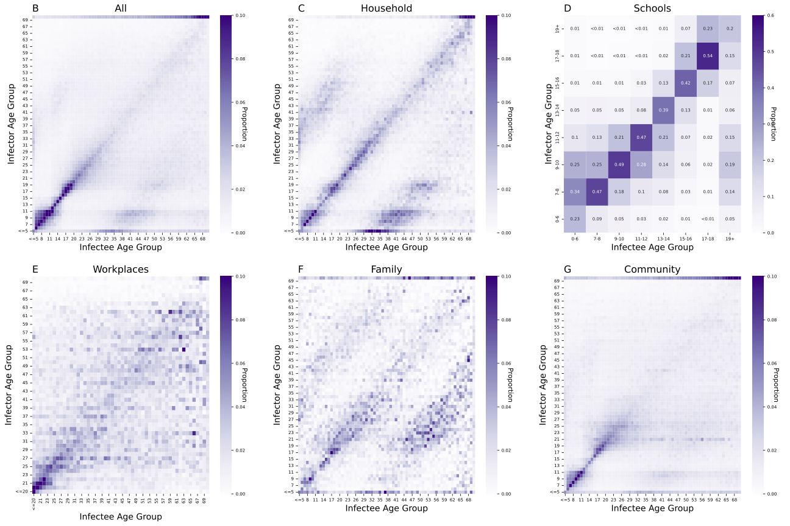

## Danish_Transmission_NPIs_Cov19
Code repository for inferring transmission networks from Danish SARS-CoV-2 viral genome data and modelling the impact of NPIs in Denmark.

## Authors
* Jacob-Curran Sebastian (<jaccur@itu.dk>)
* Christian Morgenstern (<c.morgenstern@imperial.ac.uk>)

## Age-structure matrices
The folder age_matrices contains median age-structure matrices for sampled infector-infectee pairs in our analysis. Those age matrices with the suffix "_1_year" correspond to the age groupings presented in the manuscript (and below), but we also include age groups of 5 and 10 years, which are given in these folders. 

## Packages and Dependencies

Analysis conducted using Python version 3.11.13 using the following packages:

- Numpy v2.3.3
- Pandas v2.2.3
- tqdm v4.67.1
- biopython v1.85
- regex v2.5.161
- hammingdist v1.3.0
- polars v1.33.1
- geopandas v1.1.1
- jupyter v1.1.1
- matplotlib v3.10.6
- scipy v1.16.2
- seaborn v0.13.2
- networkx v3.5
 
Typical install time < 1 minute

In addition, we have made use of the following libraries in R:

- tidyverse
- tidybayes
- rstan
- brms
- patchwork
- zoo
- MASS
- lme4
- jtools

## Demo

In /src/Demo/ we have provided a streamlined version of our code, as well as some randomly generated artificial data that can be used to run the code. Since the data is generated randomly, the outputs of the demo do not correspond at all to those in the main paper, but rather are intended ot give an illustration of how the code can be run and adapted. 

All of the code to run the main analysis can be found in a single jupyter notebook, in the folder python within the Demo folder, called demo_pipeline.ipynb. The artificial data is already provided in the GitHub repo (in the data folder), but users can re-generate data (possibly with alternative parameter choices) using the notebook generate_demo_data.ipynb. 

Additionally, we have provided some R code for producing plots of the reproduction number, overdispersion and NPI effects from the outputs of demo_pipeline.ipynb. It is optional to run these as well. 

## Data availability

The data utilised in this study is accessible under restricted conditions under Danish data protection laws. Researchers can request access to the data from The Danish Health Data Authority, Statistics Denmark and Statens Serum Institut, complying with Danish data protection regulations and any necessary permissions. No data collection or sequencing was conducted specifically for this study. 

